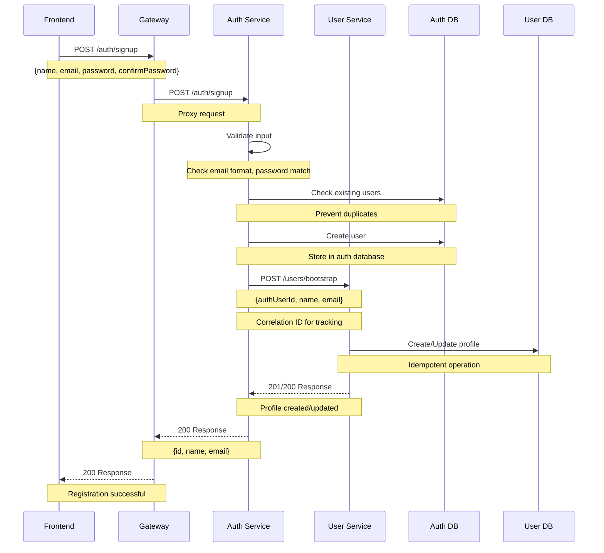
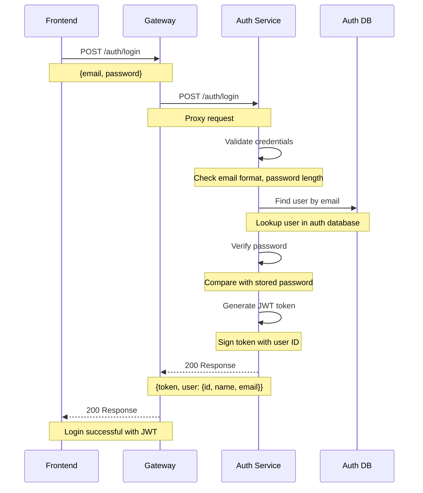
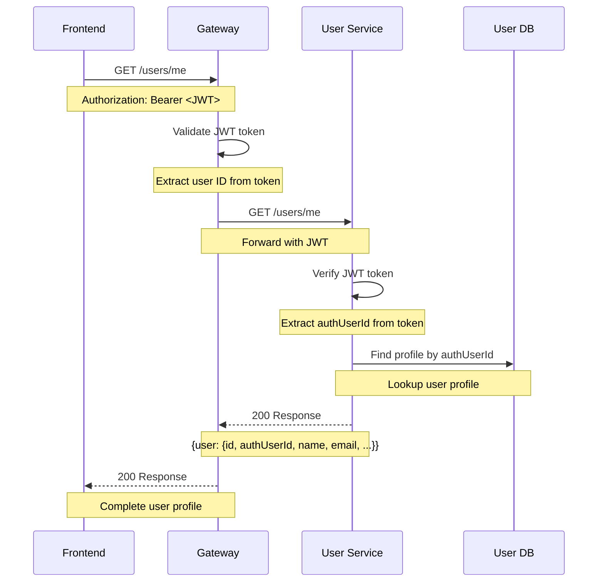

# Backend Microservices Architecture

This backend is built using a **microservices architecture** with Fastify, Prisma, and SQLite. The system is divided into three main services: **Auth Service**, **User Service**, and **API Gateway**.

## 🏗️ Architecture Overview

```
┌─────────────────┐    ┌─────────────────┐    ┌─────────────────┐
│   Frontend      │    │   API Gateway   │    │   Auth Service  │
│   (Port 3000)   │◄──►│   (Port 3003)   │◄──►│   (Port 3001)   │
└─────────────────┘    └─────────────────┘    └─────────────────┘
                                │
                                ▼
                       ┌─────────────────┐
                       │  User Service   │
                       │   (Port 3002)   │
                       └─────────────────┘
```

## 🚀 Quick Start

### Prerequisites
- Node.js (v18 or higher)
- npm

### First Installation

**Auth Service Setup:**
```bash
cd backend/auth-service
npm install
npx prisma migrate dev
npx prisma generate
npm run seed
```

**User Service Setup:**
```bash
cd backend/user-service
npm install
npx prisma migrate dev
npx prisma generate
npm run seed
```

**Gateway Setup:**
```bash
cd backend/gateway
npm install
```

**Frontend Setup:**
```bash
cd frontend
npm install
```

### Running the Services

If already installed, start each service in separate terminals:

**Terminal 1 - Auth Service (Port 3001):**
```bash
cd backend/auth-service
npm install  # Just in case something new happened
npm run dev
```

**Terminal 2 - User Service (Port 3002):**
```bash
cd backend/user-service
npm install  # Just in case something new happened
npm run dev
```

**Terminal 3 - Gateway (Port 3003):**
```bash
cd backend/gateway
npm install  # Just in case something new happened
npm run dev
```

**Terminal 4 - Frontend (Port 3000):**
```bash
cd frontend
npm install  # Just in case something new happened
npm run dev
```

### Verify Services
```bash
# Check if all services are running
curl http://localhost:3001/health  # Auth Service
curl http://localhost:3002/health  # User Service  
curl http://localhost:3003/health  # Gateway
curl http://localhost:3000         # Frontend
```

## 📋 Services

### 🔐 Auth Service (Port 3001)
- **Purpose**: User authentication, registration, JWT token management
- **Database**: `auth.db` (SQLite)
- **Endpoints**: `/auth/login`, `/auth/signup`
- **Dependencies**: Fastify, Prisma, JWT, Axios

### 👤 User Service (Port 3002)
- **Purpose**: User profiles, friends, game statistics
- **Database**: `user.db` (SQLite)
- **Endpoints**: `/users`, `/users/me`, `/users/bootstrap`
- **Dependencies**: Fastify, Prisma, JWT

### 🌐 API Gateway (Port 3003)
- **Purpose**: Single entry point, request routing, authentication
- **Features**: JWT validation, request proxying, logging
- **Routes**: `/auth/*` → Auth Service, `/users/*` → User Service

---

## 🔄 Authentication Flows

### 1. User Registration (Signup) Flow



**Key Features:**
- ✅ **Idempotent**: Multiple calls won't create duplicates
- ✅ **Error Handling**: Auth user created even if profile fails
- ✅ **Correlation Tracking**: Full request tracing
- ✅ **Validation**: Input sanitization and format checking

### 2. User Login Flow



**Key Features:**
- ✅ **Security**: Generic error messages prevent user enumeration
- ✅ **JWT Tokens**: Stateless authentication
- ✅ **Validation**: Input sanitization
- ✅ **Error Handling**: Graceful failure responses

### 3. User Profile Access Flow



---

## 🗄️ Database Schema

### Auth Service Database (`auth.db`)
```sql
model User {
  id        Int      @id @default(autoincrement())
  email     String   @unique
  name      String   @unique
  password  String
  createdAt DateTime @default(now())
  updatedAt DateTime @updatedAt
}
```

### User Service Database (`user.db`)
```sql
model UserProfile {
  id          Int      @id @default(autoincrement())
  authUserId  Int      @unique  -- References auth-service user ID
  name        String   -- Duplicated for performance
  email       String   -- Duplicated for performance
  createdAt   DateTime @default(now())
  updatedAt   DateTime @updatedAt
  
  -- Profile information
  profilePicture String?
  bio           String?
  
  -- Friends relationships
  friends       UserProfile[] @relation("UserFriends")
  friendOf      UserProfile[] @relation("UserFriends")
  
  -- Game data
  matchHistory  Json?  -- Game match history
  stats         Json?  -- User statistics
}
```

---

## 🔧 Environment Variables

Create a `.env` file in the root directory:

```env
# Service Ports
AUTH_SERVICE_PORT=3001
USER_SERVICE_PORT=3002
GATEWAY_PORT=3003
FRONTEND_PORT=3000

# Database URLs
AUTH_DATABASE_URL="file:./prisma/auth.db"
USER_DATABASE_URL="file:./prisma/user.db"

# JWT Configuration
JWT_SECRET="your-super-secret-jwt-key-here"

# Service URLs (for inter-service communication)
USER_SERVICE_URL="http://localhost:3002"

# Host Configuration
HOST="0.0.0.0"
NODE_ENV="development"
```

---

## 🧪 Testing the Flows

### Test Registration Flow
```bash
# 1. Start all services
make run-all

# 2. Test signup
curl -X POST http://localhost:3003/auth/signup \
  -H "Content-Type: application/json" \
  -d '{
    "name": "testuser",
    "email": "test@example.com",
    "password": "password123",
    "confirmPassword": "password123"
  }'

# Expected: 200 with {id, name, email}
```

### Test Login Flow
```bash
# 1. Test login
curl -X POST http://localhost:3003/auth/login \
  -H "Content-Type: application/json" \
  -d '{
    "email": "test@example.com",
    "password": "password123"
  }'

# Expected: 200 with {token, user: {id, name, email}}
```

### Test Profile Access
```bash
# 1. Get user profile (replace TOKEN with actual JWT)
curl -X GET http://localhost:3003/users/me \
  -H "Authorization: Bearer YOUR_JWT_TOKEN"

# Expected: 200 with complete user profile
```

---

## 📊 Monitoring & Logging

### Correlation IDs
All requests include correlation IDs for tracking across services:
- Format: `auth-{userId}-{timestamp}` or `user-{userId}-{timestamp}`
- Headers: `X-Correlation-ID`
- Logs: Full request tracing across all services

### Health Checks
```bash
# Check service health
curl http://localhost:3001/health  # Auth Service
curl http://localhost:3002/health  # User Service  
curl http://localhost:3003/health  # Gateway
```

### Service Logs
```bash
# View logs for specific service
make logs-auth    # Auth Service logs
make logs-user    # User Service logs
make logs-gateway # Gateway logs
```

---

## 🚨 Error Handling

### Registration Errors
- **400**: Validation errors (missing fields, invalid email, password mismatch)
- **400**: Duplicate user (name or email already exists)
- **500**: Internal server error

### Login Errors
- **400**: Missing credentials
- **401**: Invalid credentials (generic message for security)
- **500**: Internal server error

### Profile Errors
- **401**: Unauthorized (invalid/missing JWT)
- **404**: User profile not found
- **500**: Internal server error

---

## 🔄 Inter-Service Communication

### Auth Service → User Service
- **Endpoint**: `POST /users/bootstrap`
- **Purpose**: Create/update user profile after registration
- **Timeout**: 5 seconds
- **Retry**: None (logs failure, continues with auth success)
- **Idempotent**: Yes (creates or updates based on `authUserId`)

### Gateway → Services
- **Auth Service**: All `/auth/*` routes
- **User Service**: All `/users/*` routes
- **Authentication**: JWT validation for protected routes
- **Logging**: Request/response logging with correlation IDs

---

## 🛠️ Development Commands

### Starting Services
```bash
# Start individual services in separate terminals
cd backend/auth-service && npm run dev    # Port 3001
cd backend/user-service && npm run dev    # Port 3002
cd backend/gateway && npm run dev         # Port 3003
cd frontend && npm run dev                # Port 3000
```

### Database Management
```bash
# Auth Service Database
cd backend/auth-service
npx prisma migrate dev    # Run migrations
npx prisma generate       # Generate Prisma client
npx prisma studio         # Open database GUI

# User Service Database
cd backend/user-service
npx prisma migrate dev    # Run migrations
npx prisma generate       # Generate Prisma client
npx prisma studio         # Open database GUI
```

### Testing & Debugging
```bash
# Test individual services
curl http://localhost:3001/health  # Auth Service
curl http://localhost:3002/health  # User Service
curl http://localhost:3003/health  # Gateway

# View service logs (each terminal shows its own logs)
# Auth Service logs: User registration, login attempts, JWT generation
# User Service logs: Profile creation, bootstrap operations
# Gateway logs: Request routing, JWT validation, proxy operations
```

### Cleanup
```bash
# Stop services: Ctrl+C in each terminal

# Clean node_modules (if needed)
rm -rf backend/auth-service/node_modules
rm -rf backend/user-service/node_modules  
rm -rf backend/gateway/node_modules
rm -rf frontend/node_modules

# Drop databases (if needed)
rm -f backend/auth-service/prisma/auth.db
rm -f backend/user-service/prisma/user.db

# Reinstall dependencies
cd backend/auth-service && npm install
cd backend/user-service && npm install
cd backend/gateway && npm install
cd frontend && npm install

# Recreate databases after cleanup
cd backend/auth-service
npx prisma migrate dev
npx prisma generate
npm run seed

cd backend/user-service
npx prisma migrate dev
npx prisma generate
npm run seed
```


## 🤝 Contributing

1. Follow the existing code style and patterns
2. Add comprehensive logging with correlation IDs
3. Include proper error handling
4. Update documentation for any new features
5. Test all flows before submitting changes

---

## 📄 License

This project is part of the ft_transcendence study project at School 42.
